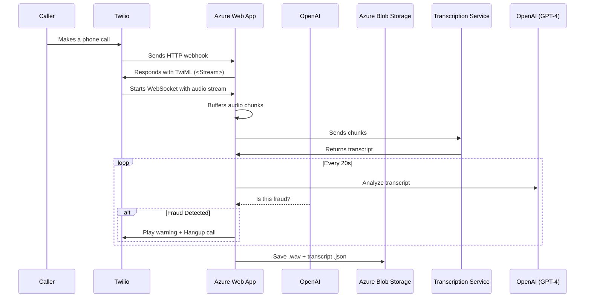

# 📞 Real-Time Voice Call Transcription & Fraud Detection (.NET 8 + Azure)

This is a **.NET 8 Azure Web App** that integrates with **Twilio Programmable Voice**, **Azure Blob Storage**, **OpenAI GPT-4**, and optionally **Deepgram** or **Azure Speech Services** to perform real-time transcription and scam detection during phone calls.

> 🔐 If fraud is detected during a call, the system plays a warning message and immediately terminates the call using Twilio.

---

## 🚀 Features

- Real-time voice ingestion via Twilio `<Stream>`
- Live audio transcription using Deepgram or Azure Speech
- Fraud detection every 20 seconds using GPT-4
- Immediate call termination via Twilio REST API if fraud is detected
- Audio (.wav) and transcript (.json) saved to Azure Blob Storage
- Minimal architecture (no AKS, no Service Bus, no Front Door)
- Ready for deployment on Azure Web App with WebSocket support

---

## 🧱 Architecture Overview

